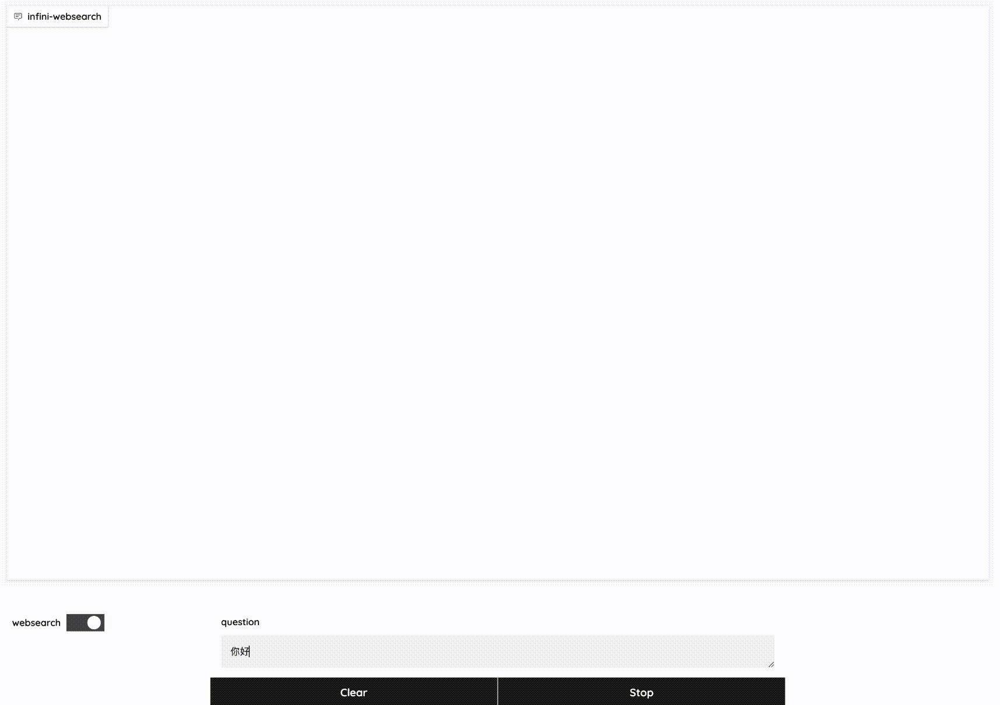

# InfiniWebSearch

基于Megrez-3B-Instruct搭建的demo, 接入网络搜索工具增强模型的问答能力.

Read this in [English](README_en.md)

<div align="center">
    
</div>

## 项目简介

本工程包含如下几部分:

- gradio服务 ([gradio_app.py](gradio_app.py)): 定义了整个app的workflow
- 网络搜索服务 ([search_service.py](infini_websearch/service/search_service.py)): 搜索网页, 加载网页
- 模型服务: 聊天问答, 工具调用, 总结网页内容

## 快速上手

### 安装

```shell
git clone xxx
cd infini_websearch
conda create -n infini_websearch python=3.10 -y
conda activate infini_websearch
pip install -r requirements.txt
pip install -e .
```

### 运行demo

#### 1. 启动网络搜索服务

以Ubuntu环境为例, 从[Google Chrome Labs](https://googlechromelabs.github.io/chrome-for-testing/)下载**chrome**和**chromedriver**并解压到本地.

```
cd infini_websearch/service
wget https://storage.googleapis.com/chrome-for-testing-public/128.0.6613.86/linux64/chrome-linux64.zip
wget https://storage.googleapis.com/chrome-for-testing-public/128.0.6613.86/linux64/chromedriver-linux64.zip
unzip chrome-linux64.zip
unzip chromedriver-linux64.zip
```

安装依赖

```shell
sudo apt-get update
sudo apt-get install -y \
    libatk-bridge2.0-0 \
    libatk1.0-0 \
    libgconf-2-4 \
    libnss3 \
    libxss1 \
    libappindicator1 \
    libindicator7 \
    libasound2 \
    libxcomposite1 \
    libxcursor1 \
    libxdamage1 \
    libxi6 \
    libxtst6 \
    libglib2.0-0 \
    libpango1.0-0 \
    libcups2 \
    libxrandr2 \
    libxrandr-dev \
    libxkbcommon0 \
    libgbm1
```

在[Serper](https://serper.dev/)注册账户获得`SERPER_API_KEY`, 并添加到环境变量中.
启动网络搜索服务并指定端口号.
在[server.py](infini_websearch/configs/server.py)设置`SEARCH_SERVER_URL`为 http://localhost:8021/search .

```shell
export SERPER_API_KEY=$YOUR_API_KEY
cd infini_websearch/service
python search_service.py --port 8021 --chrome ./chrome-linux64/chrome --chromedriver ./chromedriver-linux64/chromedriver
```

#### 2. 启动模型服务

使用vllm.entrypoints.openai.api_server启动服务并制定端口号, `--served-model-name`设置为megrez, `--max-seq-len`设置为4096.
在[server.py](infini_websearch/configs/server.py)设置`MODEL_SERVER_URL`, 默认为 http://localhost:8011/v1/ . 设置`MODEL_NAME`为"megrez".

```shell
python -m vllm.entrypoints.openai.api_server --served-model-name megrez --model $MODEL_PATH --port 8011 --max-seq-len 4096 --trust_remote_code
```

#### 3. 启动gradio服务

运行[gradio_app.py](infini_websearch/gradio_app.py), 指定模型路径和端口号.
```shell
python gradio_app.py -m $MODEL_PATH --port 7860
```

成功启动之后, 访问 http://localhost:7860/ 即可使用

## 说明

1. 由于模型有效最大输出长度较短(4k), 我们提供了`WEBPAGE_SUMMARY_MAX_INPUT_TOKENS`, `WEBPAGE_SUMMARY_MAX_OUTPUT_TOKENS`, `SESSION_MAX_INPUT_TOKENS`, `CHAT_MAX_OUTPUT_TOKENS`, `AGENT_MAX_OUTPUT_TOKENS`来控制模型的输入和输出长度. 使用`SESSION_WINDOW_SIZE`来保留最近的几轮对话历史.你可以在[server.py](infini_websearch/configs/server.py)中按需修改.
2. 已经开始首轮对话后，点击websearch toggle切换状态会在后端清空对话历史, 但前端显示依然保留对话历史.
3. 如果搜索服务出现异常(例如: 网页加载超时或服务器异常), 工具调用的observation会返回预定义好的信息(例如: "搜索页面加载超时, 请重试").你可以在[websearch.py](infini_websearch/actions/websearch.py)和[search_service.py](infini_websearch/service/search_service.py)中自定义边界条件的后处理逻辑.
4. 使用[Serper](https://serper.dev/)时([search_service.py](infini_websearch/service/search_service.py)), 我们设置"hl"参数为"zh-CN"来尽可能得到中文搜索结果. 如果搜索结果英文网页太多, 可能导致模型用英文回答.

## 协议

- 本开源仓库的代码则遵循 [Apache 2.0](LICENSE) 协议.
