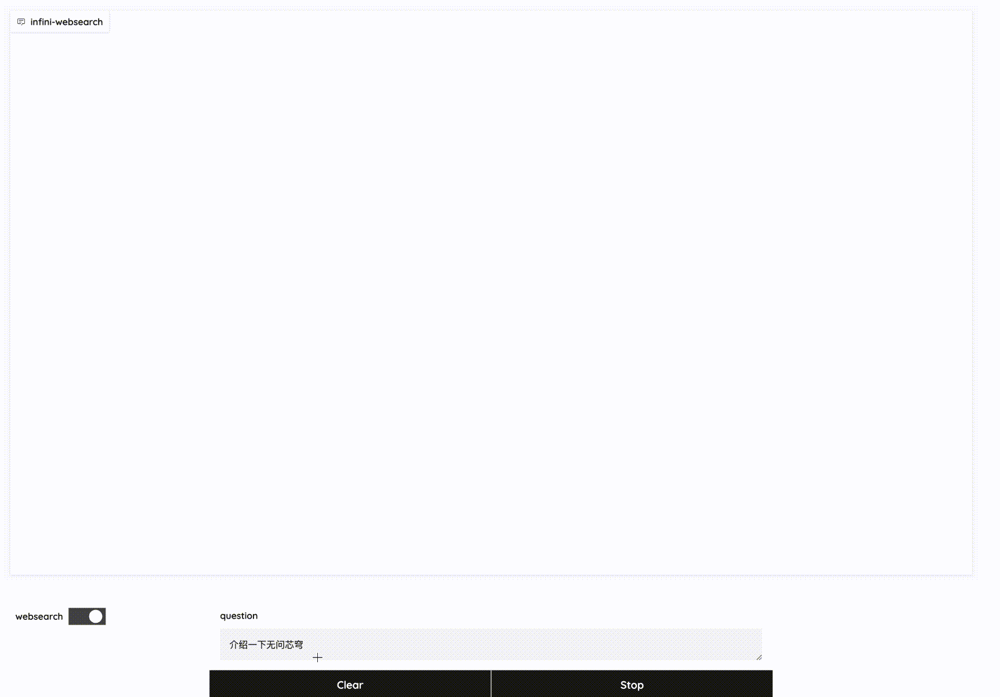

# InfiniWebSearch

A demo built on Megrez-3B-Instruct, integrating a web search tool to enhance the model's question-and-answer capabilities.

[中文阅读](README.md).

<div align="center">
    
</div>

## Project Introduction

This project consists of the following parts:

- Gradio service ([gradio_app.py](gradio_app.py)): Defines the entire app's workflow.
- Web search service ([search_service.py](infini_websearch/service/search_service.py)): Searches for web pages and loads web pages.
- Model service: Chat, function calling and summarize web page.

## Quick start

### Install

```shell
git clone xxx
cd infini_websearch
conda create -n infini_websearch python=3.10 -y
conda activate infini_websearch
pip install -r requirements.txt
pip install -e .
```

### Running Demo

#### 1. Starting Web Search Service

As an example for the Ubuntu environment, download **chrome** and **chromedriver** from [Google Chrome Labs](https://googlechromelabs.github.io/chrome-for-testing/) and unzip them to the local directory.

```
cd infini_websearch/service
wget https://storage.googleapis.com/chrome-for-testing-public/128.0.6613.86/linux64/chrome-linux64.zip
wget https://storage.googleapis.com/chrome-for-testing-public/128.0.6613.86/linux64/chromedriver-linux64.zip
unzip chrome-linux64.zip
unzip chromedriver-linux64.zip
```

Install dependencies

```shell
sudo apt-get update
sudo apt-get install -y \
    libatk-bridge2.0-0 \
    libatk1.0-0 \
    libgconf-2-4 \
    libnss3 \
    libxss1 \
    libappindicator1 \
    libindicator7 \
    libasound2 \
    libxcomposite1 \
    libxcursor1 \
    libxdamage1 \
    libxi6 \
    libxtst6 \
    libglib2.0-0 \
    libpango1.0-0 \
    libcups2 \
    libxrandr2 \
    libxrandr-dev \
    libxkbcommon0 \
    libgbm1
```

Register an account on [Serper](https://serper.dev/) to obtain `SERPER_API_KEY` and add it to the environment variable.
Start the web search service and specify the port number.
Set the `SEARCH_SERVER_URL` to http://localhost:8021/search in the file [server.py](infini_websearch/configs/server.py).

```shell
export SERPER_API_KEY=$YOUR_API_KEY
cd infini_websearch/service
python search_service.py --port 8021 --chrome ./chrome-linux64/chrome --chromedriver ./chromedriver-linux64/chromedriver
```

#### 2. Starting Model Service

Use vllm.entrypoints.openai.api_server to start the service and specify the port number. Set the `--served-model-name` to "megrez" and `--max-seq-len` to 4096.
Set the `MODEL_SERVER_URL` in the file [server.py](infini_websearch/configs/server.py) with a default value of http://localhost:8011/v1/. Also, set the `MODEL_NAME` to "megrez".

```shell
python -m vllm.entrypoints.openai.api_server --served-model-name megrez --model $MODEL_PATH --port 8011 --max-seq-len 4096 --trust_remote_code
```

#### 3. Starting Gradio Service

Run [gradio_app.py](infini_websearch/gradio_app.py), specify the model path and port number.

```shell
python gradio_app.py -m $MODEL_PATH --port 7860
```

After successful startup, you can use it by visiting http://localhost:7860/.

## Notes

1. Due to the model's effective maximum output length being relatively short (4k), we provide `WEBPAGE_SUMMARY_MAX_INPUT_TOKENS`, `WEBPAGE_SUMMARY_MAX_OUTPUT_TOKENS`, `SESSION_MAX_INPUT_TOKENS`, `CHAT_MAX_OUTPUT_TOKENS`, `AGENT_MAX_OUTPUT_TOKENS` to control the input and output lengths of the model. Use `SESSION_WINDOW_SIZE` to retain the most recent dialogue history. You can modify these settings as needed in [server.py](infini_websearch/configs/server.py).
2. After starting the first round of dialogue, toggling the websearch state will clear the dialogue history on the backend, but the frontend will still display the dialogue history.
3. If there is an exception with the search service (e.g. webpage loading timeout or server error), the observation from the tool call will return predefined messages (e.g. "The search page loading timed out, please try again"). You can customize the post-processing logic for boundary conditions in [websearch.py](infini_websearch/actions/websearch.py) and [search_service.py](infini_websearch/service/search_service.py).
4. When using [Serper](https://serper.dev/) ([search_service.py](infini_websearch/service/search_service.py)), we set the "hl" parameter to "zh-CN" to obtain Chinese search results as much as possible. If there are too many English webpages in the search results, it may lead to the model responding in English.

## License

The code in this open-source repository follows the [Apache 2.0](LICENSE) license.
